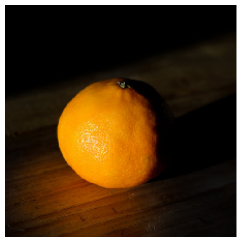

<div align="center" id="gridexp">


<div align="center">
  
  
</div>


</div>


# AI Explanation Tool, GridExplainer: Visual Model Explanation via Grid-Based Occlusion

GridExplainer is a simple yet powerful interpretability tool for deep learning image models. It provides intuitive, visual explanations by measuring how hiding different image segments affects model confidence.

---

## Purpose
While advanced tools like SHAP, LIME, and Grad-CAM provide rich, gradient or perturbation-based explanations, they often rely on:

- Complex mathematical abstractions

- Internal model access (e.g., gradients, layers)

- Outputs that are hard to explain to non-technical users


GridExplainer was developed with this key idea:
<pre>
❓ “Why not visually show which regions matter most — by simply hiding them and observing the effect?”
</pre>

This approach results in transparent, grid-based visualizations that mimic human reasoning and are easy to interpret.

---

## Why GridExplainer Makes Sense

1. Direct Visual Feedback
Instead of analyzing internal activations, GridExplainer asks:

- “If I hide this part of the image, does the model get less confident?”

This produces concrete, verifiable evidence — no guesswork.

2. Alignment with Human Intuition
Humans tend to say:

- “It’s a dog because of the ears and the snout.”

GridExplainer systematically occludes parts of the image, simulating how people visually diagnose features.

3. Transparency over Complexity
While it may not offer theoretical optimality, it offers trust, clarity, and usability, which are essential in:

- Medical AI

- Legal tech

- Business intelligence

- Public-facing models


---

## How It Works

1. Grid segmentation: The input image is split into an N×N grid.

2. Occlusion-based perturbation: Each cell is masked (by mean value) one at a time.

3. Importance scoring: We record how much the prediction confidence drops.

4. Visualization: A heatmap grid is overlaid showing the impact of each cell.


---

## Technologies Used

- TensorFlow / Keras
- ResNet50 (pre-trained ImageNet model)
- Matplotlib / OpenCV / NumPy
- SHAP dataset (for test images)
- Google Colab-compatible

---

## Installation

```bash
 pip install shap opencv-python tensorflow matplotlib

```

---

## Quick Start

```bash
from tensorflow.keras.applications.resnet50 import ResNet50
from grid_explainer import GridExplainer

# Load model and image
model = ResNet50(weights="imagenet")
X, y = shap.datasets.imagenet50()
img = X[49]

# Explain
explainer = GridExplainer(model, grid_size=8)
explainer.explain(img)
explainer.visualize()

```

You can use any image sample between 0-50, and you can also try different samples that are not in the dataset.

---


## Notes

- Works on any image classification model (even black-box ones).

- The cell masking strategy is currently "mean replacement" but can be extended.

- Designed for interpretability and education, not production-scale attribution.


---

## Sample Outputs

Here are examples of the GridExplainer in action. Each grid cell shows the relative importance of that segment for the model’s prediction:

- You can interpret the numbers on each cell as "how important this region was" — the higher the number, the bigger the drop in confidence when occluded.

<table>
    <tr>
    <td>Original Image</td>
    <td>Grid Explanation</td>
  </tr>
  
  <tr>
    <td></td>
    <td></td>
  </tr>

 <tr>
    <td></td>
    <td></td>
  </tr>

   <tr>
    <td></td>
    <td></td>
  </tr>

   <tr>
    <td></td>
    <td></td>
  </tr>

   <tr>
    <td></td>
    <td></td>
  </tr>

   <tr>
    <td></td>
    <td></td>
  </tr>

   <tr>
    <td></td>
    <td></td>
  </tr>

   <tr>
    <td></td>
    <td></td>
  </tr>
  
   <tr>
    <td></td>
    <td></td>
  </tr>

   <tr>
    <td></td>
    <td></td>
  </tr>

   <tr>
    <td></td>
    <td></td>
  </tr>

   <tr>
    <td></td>
    <td></td>
  </tr>

   <tr>
    <td></td>
    <td></td>
  </tr>

</table>


